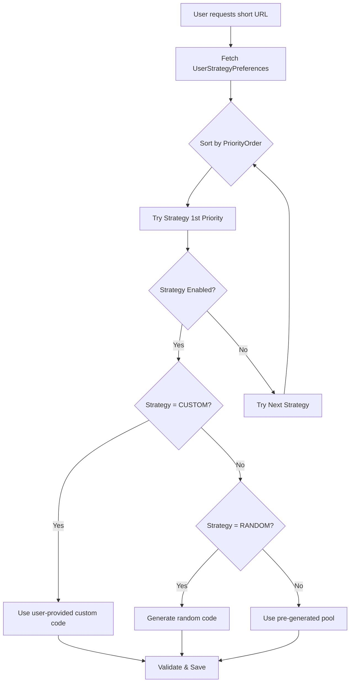

# ShortCodeConfig Redesign Plan

## Problem Statement

The current [`ShortCodeConfig`](src/main/java/com/example/demo/shortenurl/entity/ShortCodeConfig.java) entity mixes two different concerns:

1. **Pre-generated shortcodes** (code pool) - storing actual shortcode strings
2. **User strategy preferences** - priority order for generation methods

This design cannot properly fulfill the requirement: *"user can decide their preference way for short URL pattern"*

### Issues with Current Design

| Field | Problem |
|-------|---------|
| `code` | Stores actual shortcodes - this is data, not preference |
| `strategy` | Single value - cannot express priority order |
| `preferenceOrder` | Ambiguous - what is being ordered? |
| One row per code | Doesn't represent user's strategy preferences |

---

## Proposed Solution

Separate the concerns into two distinct entities:

### Entity 1: UrlPreference

Stores each user's priority order for different generation strategies. Can have a global default (USERID = null) that applies to all users.

```java
@Entity
@Table(name = "URL_PREFERENCE")
public class UrlPreference {
    
    @Id
    @GeneratedValue(strategy = GenerationType.IDENTITY)
    @Column(name = "ID")
    private Long id;
    
    // Direct user ID - null means this is the global default
    @Column(name = "USERID")
    private Long userId;
    
    @Enumerated(EnumType.STRING)
    @Column(name = "STRATEGY", nullable = false)
    private StrategyType strategy;  // CUSTOM, RANDOM, USER_PREFERENCE
    
    @Column(name = "PRIORITY_ORDER", nullable = false)
    private Integer priorityOrder;  // 1 = highest priority
    
    @Column(name = "IS_ENABLED", nullable = false)
    private Boolean isEnabled = true;
    
    // Additional config per strategy (optional)
    @Column(name = "CONFIG_JSON", columnDefinition = "TEXT")
    private String configJson;  // For strategy-specific settings
    
    @Column(name = "IS_DEFAULT")
    private Boolean isDefault = false;  // If true, applies to all users
}
```

**Example Data:**
| ID | USERID | STRATEGY | PRIORITY_ORDER | IS_ENABLED | IS_DEFAULT |
|----|--------|----------|----------------|------------|-------------|
| 1 | NULL | CUSTOM | 1 | true | true |
| 2 | NULL | RANDOM | 2 | true | true |
| 3 | NULL | USER_PREFERENCE | 3 | false | true |
| 4 | 5 | CUSTOM | 1 | true | false |
| 5 | 5 | RANDOM | 2 | false | false |

*Note: User-specific preferences (USERID = 5) override global defaults (USERID = NULL)*

---

### Entity 2: PreGeneratedCode (Optional)

If using a pre-generated code pool for better performance:

```java
@Entity
@Table(name = "PRE_GENERATED_CODES")
public class PreGeneratedCode {
    
    @Id
    @GeneratedValue(strategy = GenerationType.IDENTITY)
    private Long id;
    
    @Column(name = "CODE", unique = true, nullable = false)
    private String code;
    
    @Column(name = "IS_USED", nullable = false)
    private Boolean isUsed = false;
    
    @Column(name = "CHARACTER_SET")
    private String characterSet;  // ALPHANUMERIC, NUMERIC, etc.
    
    @Column(name = "LENGTH")
    private Integer length;
}
```

---

## How It Works

### Generation Flow



### API for User Preferences

```
GET    /api/url-preferences          # Get global defaults
GET    /api/url-preferences?userId=5 # Get user-specific preferences
POST   /api/url-preferences          # Create new preference
PUT    /api/url-preferences/{id}     # Update preference
DELETE /api/url-preferences/{id}     # Delete preference
```

---

## Migration Strategy

1. **Keep existing `ShortCodeConfig`** temporarily for backward compatibility
2. **Create new `UrlPreference` entity** with direct Long userId field
3. **Create new `PreGeneratedCode` entity** (if needed)
4. **Update `UrlService`** to use new preference system
5. **Deprecate and remove old `ShortCodeConfig`** in future version

---

## Summary

| Aspect | Current Design | New Design |
|--------|----------------|------------|
| User preferences | Mixed with code storage | Separate `UrlPreference` table |
| Priority order | Ambiguous (`preferenceOrder` on each code) | Clear priority per strategy type |
| Multiple strategies | Single strategy per row | Multiple rows per user, one per strategy |
| Global defaults | Not supported | `USERID = NULL` for default preferences |
| Extensibility | Limited | Can add config per strategy |

This design clearly separates:
- **What** the user wants (preferences)
- **How** it's generated (strategies)
- **Data** used (pre-generated codes pool)
